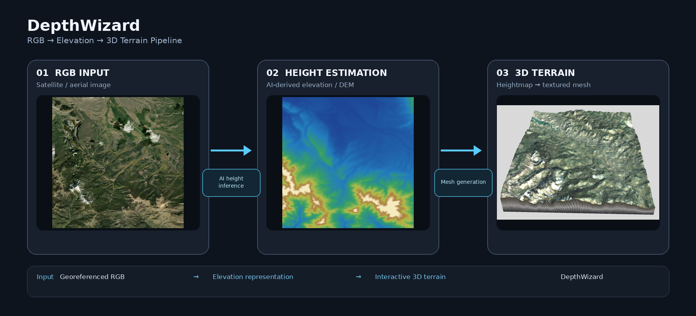
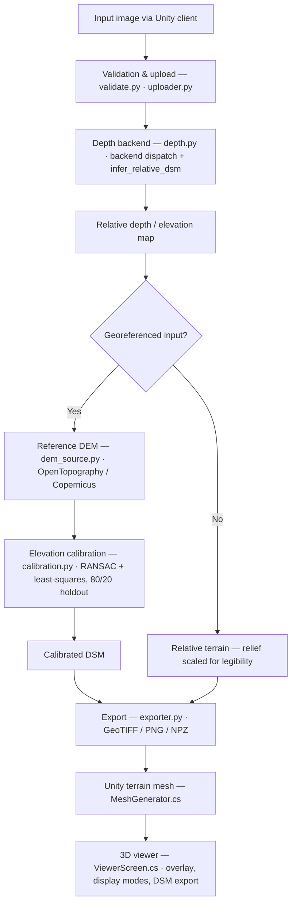
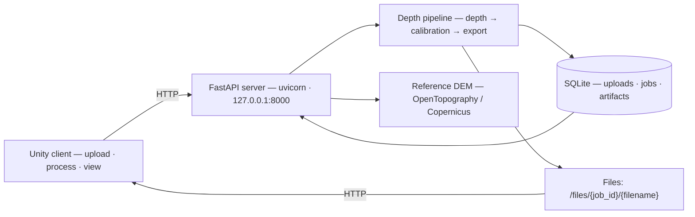

<div align="center">

# DepthWizard

**Single-Image → 3D Terrain Reconstruction & Elevation Analysis**

DepthWizard turns a satellite or aerial photo into a real-world-scaled 3D terrain
representation. A monocular depth model estimates relative elevation, which is then
calibrated against DEM ground truth when georeferencing is available and rendered as an
interactive 3D mesh in Unity.

[](server/pyproject.toml)
[](unity-client/ProjectSettings/ProjectVersion.txt)
[](server/app/main.py)
[](server/pyproject.toml)

</div>

---

## Demo

Upload a satellite or aerial photo, click **Process**, and watch the server reconstruct a
real-world-scaled terrain mesh you can fly around in the Unity client.

**Interactive 3D Terrain Reconstruction** — the generated terrain mesh is visualized with
elevation-based geometry and satellite imagery. Demo media (animations and georeferenced /
relative output examples) are attached to each [GitHub Release](https://github.com/Tron-xR/DepthWizard/releases).

---

## Pipeline

<p align="center">
  
</p>

---

## Key Capabilities

| Capability | Description |
|---|---|
| Satellite / aerial image processing | Upload a single image; the server validates, infers, calibrates and exports automatically |
| Monocular depth estimation | Four pluggable depth backends behind one shared inference interface |
| DEM-calibrated elevation | Georeferenced inputs are calibrated against OpenTopography / Copernicus reference DEMs |
| Georeferenced output | Calibrated elevation exported as GeoTIFF DSM with ground coordinates |
| Relative terrain | Non-georeferenced inputs still produce a scannable, naturally-relieved terrain |
| 3D terrain mesh generation | Heightmap → Unity terrain mesh built at runtime |
| Unity visualization | Free-fly camera, DEM overlay, display modes, native DSM export dialog |
| Held-out evaluation | `/evaluate` endpoint with 80/20 holdout scoring and per-site reports |
| Offline / local processing | Self-contained local client + server; optional packaged Windows server |

---

## How It Works

### Inference pipeline



Model dispatch (`depth.py`) resolves the active backend first; calibration and export are
pipeline stages that apply regardless of which backend produced the prediction.

### Client / server architecture



The client is the front-end; the server owns all inference, calibration and export. A
packaged single-folder Windows build of the server is documented in
[`server/DEPLOYMENT.md`](server/DEPLOYMENT.md).

---

## Quick Start

1. **Clone the repository**

   ```bash
   git clone https://github.com/Tron-xR/DepthWizard.git
   cd DepthWizard
   ```

2. **Start the server**

   ```bash
   cd server
   uv sync
   uv run uvicorn app.main:app --host 127.0.0.1 --port 8000
   ```

3. **Verify it is running**

   Open `http://127.0.0.1:8000/health` — you should see `{"status": "ok"}`.

   > A fresh clone runs out of the box with the **Depth Anything V2** backend, which is
   > auto-downloaded from Hugging Face. The heavier pix2pix / IMELE weights and the
   > fine-tuned checkpoint are not stored in the repository — see
   > [Optional Model Weights](#optional-model-weights).

4. **Run the Unity client**

   1. Open **Unity Hub** → **Add project from disk** → select the `unity-client/` folder.
   2. Unity prompts to install **6000.3.11f1** — accept it.
   3. Press **Play**.

   The client calls `http://127.0.0.1:8000` by default; change it on the **Settings**
   screen if your server runs elsewhere.

<details>
<summary><strong>Package the server for machines without Python</strong></summary>

The FastAPI server can be frozen into a single Windows folder (PyInstaller) and shipped
inside the Unity build, so end users need no Python installation. See
[`server/DEPLOYMENT.md`](server/DEPLOYMENT.md) for the rebuild and packaging workflow.
</details>

---

## Prerequisites

| Tool | Version | Purpose |
|---|---|---|
| **Git** | any recent | clone the repository |
| **uv** | `>= 0.4` | Python project manager; installs everything under `server/` |
| **Python** | `3.10` | pinned by `server/pyproject.toml` (`>=3.10,<3.11`) |
| **Unity Hub** | `6000.3.11f1` | only needed for `unity-client/` |

Install **uv** on Windows:

```powershell
winget install astral-sh.uv
# or
irm https://astral.sh/uv/install.ps1 | iex
```

On macOS / Linux:

```bash
curl -LsSf https://astral.sh/uv/install.sh | sh
```

---

## Project Structure

```
DepthWizard/
├── server/                      FastAPI + ML pipeline (Python 3.10, uv)
│   └── app/
│       ├── main.py              FastAPI entrypoint
│       ├── routes.py            HTTP routes (health, upload, process, status,
│       │                        result, dem-view, export-dsm, validate, evaluate)
│       ├── config.py            env-driven configuration
│       ├── schemas.py           request/response Pydantic models
│       ├── db.py                SQLite session helpers
│       ├── jobs.py              job lifecycle / result packing
│       ├── errors.py            typed error codes
│       └── pipeline/
│           ├── validate.py      input validation
│           ├── uploader.py      upload handling
│           ├── depth.py         depth backends + dispatch
│           ├── imele.py         IMELE building-height backbone (PyTorch)
│           ├── decoder_head.py  shared trainable decoder head
│           ├── dem_source.py    OpenTopography / Copernicus DEM fetcher + cache
│           ├── calibration.py   RANSAC + least-squares elevation calibration
│           ├── exporter.py      GeoTIFF / PNG / NPZ export
│           ├── artifacts.py     per-run prediction artifact dumps + metrics
│           ├── evaluation.py    held-out site evaluation harness
│           └── perlin.py        Perlin-noise fallback
├── unity-client/                Unity 6 (6000.3.11f1) client
│   └── Assets/Scripts/
│       ├── Core/                ServerManager, DepthWizardApi, Launcher
│       ├── UI/                  MainMenu, Upload, Processing, Viewer, Settings, DSM export
│       ├── Mesh/                MeshGenerator (runtime heightmap → terrain mesh)
│       └── Camera/              FreeFlyCamera
├── decoder_training/            fine-tuned DA2 decoder training
│   ├── train_decoder.py         training pipeline (frozen backbone + decoder head)
│   └── eval_finetuned.py        held-out evaluation of the fine-tuned backend
├── sample_images/               test images + DEM ground truth (test_landscape_dem.npz)
├── gather_training.py           RGB + DEM training-pair gathering
└── 01-problem.md … 17-*.md      design and research notes
```

---

## Depth Backends

Four depth backends share one inference contract (`depth.infer_relative_dsm`).
Dispatch precedence is evaluated at model load time:

**finetuned DA2 → IMELE → pix2pix GAN → Depth Anything V2**

| Backend | Default? | Framework | Input | Enablement |
|---|---|---|---|---|
| **Depth Anything V2** | yes (fresh clone) | PyTorch / Transformers (HF) | full resolution | nothing — auto-downloads `LiheYoung/depth-anything-small-hf` |
| **pix2pix GAN** | yes (if weight present) | TensorFlow SavedModel | 512 × 512 grid, resampled back | drop a SavedModel in `models/pix2pix/` |
| **IMELE** | no | PyTorch (SENet154 + D2/MFF/R) | fixed 440 × 440 | `DEPTHWIZARD_IMELE_MODEL=/path/to/Block0_skip_model_*.tar` |
| **Fine-tuned DA2 decoder** | no | PyTorch (frozen DA2-small + trained head) | full resolution | `DEPTHWIZARD_FINETUNED_MODEL=/path/to/da2_decoder_finetuned.pt` |

### Dispatch and fallback behavior

- `DEPTHWIZARD_FINETUNED_MODEL` and `DEPTHWIZARD_IMELE_MODEL` are strictly opt-in: nothing
  is auto-discovered for them, so setting them never changes how the other backends behave.
- The pix2pix GAN is enabled when a SavedModel exists at `models/pix2pix/` (repo root).
  `DEPTHWIZARD_TF_MODEL` overrides that path; setting it to an empty string forces the
  Hugging Face Depth Anything V2 fallback.
- A fresh clone (no `models/` directory) therefore runs Depth Anything V2 out of the box.

See [Model Details](#model-details) for each backend, and
[Optional Model Weights](#optional-model-weights) for how to obtain the missing ones.

---

## Model Details

### Depth Anything V2

General monocular depth-estimation backbone (`LiheYoung/depth-anything-small-hf`) loaded
through the Hugging Face Transformers depth-estimation pipeline. Depth is predicted at
full resolution. This is the zero-configuration backend and the fallback whenever no
opt-in weights are present.

### pix2pix GAN

A TensorFlow SavedModel generator trained to mimic a normalized DEM (tanh output,
brighter = higher elevation). Inference feeds a fixed 512 × 512 grid and resamples back
to the input resolution; the model itself never runs below its clean working size. It is
the default backend when `models/pix2pix/` exists.

### IMELE

Building-height backbone from the IMELE project (SENet154 encoder + D2/MFF/R decoder,
vendored — see `server/app/pipeline/imele.py`). A fixed 440 × 440 model. Strictly opt-in
via `DEPTHWIZARD_IMELE_MODEL`.

### Fine-tuned DA2 decoder

A small trainable decoder head on a frozen Depth Anything V2-small backbone, trained with
`decoder_training/train_decoder.py`. Shares its head implementation with production
(`server/app/pipeline/decoder_head.py`) so training always matches inference. Strictly
opt-in via `DEPTHWIZARD_FINETUNED_MODEL`.

---

## Optional Model Weights

The heavy optional weights are too large to store in the repository. A fresh clone only
includes code + tests; Depth Anything V2 downloads automatically on first use.

To enable the other backends, provide the weights in the expected locations:

```bash
# pix2pix GAN
#   place the SavedModel folder at:  models/pix2pix/

# IMELE building heights
DEPTHWIZARD_IMELE_MODEL=/path/to/Block0_skip_model_*.tar

# Fine-tuned decoder head (train it yourself — see below)
DEPTHWIZARD_FINETUNED_MODEL=/path/to/da2_decoder_finetuned.pt
```

Additional runtime configuration lives in `server/app/config.py`; notable variables
include `DEPTHWIZARD_DATA` (data directory, default `server/data`),
`DEPTHWIZARD_DEPTH_MODEL` (HF model id, default `LiheYoung/depth-anything-small-hf`),
`DEPTHWIZARD_OPENTOPO_API_KEY` (free OpenTopography key for reference-DEM fetching), and
`DEPTHWIZARD_DEM_FILE` (local reference DEM file override).

---

## Fine-Tuning the Decoder Head

1. **Gather training pairs** — RGB tiles + reference DEMs (54 pairs across hilly,
   forested and sparse strata):

   ```bash
   python gather_training.py        # needs OPENTOPO_API_KEY; writes training_data/
   ```

2. **Train** — frozen DA2-small backbone, small decoder head, 30 epochs:

   ```bash
   python decoder_training/train_decoder.py --epochs 30 --seed 0 --batch 4
   ```

   The checkpoint is written to `decoder_training/checkpoints/da2_decoder_finetuned.pt`.

3. **Enable the fine-tuned backend** — either at server startup:

   ```bash
   DEPTHWIZARD_FINETUNED_MODEL=decoder_training/checkpoints/da2_decoder_finetuned.pt
   ```

   or evaluate it directly against all backends:

   ```bash
   python decoder_training/eval_finetuned.py
   ```

---

## Testing

Run the server test suite:

```bash
cd server
uv run pytest -q
```

In a developer environment with the optional weights present, the suite currently passes
**91 tests**. Tests for the opt-in backends (IMELE, fine-tuned decoder) skip automatically
when the corresponding weights are absent, mirroring the production dispatch behavior.

---

## Output Modes

### Georeferenced input

Image + geospatial metadata → reference DEM fetched or loaded → relative depth calibrated
to real elevation (RANSAC-initialized least-squares fit, 80/20 holdout split; degenerate
or negative-scale fits are flagged, never silently trusted) → calibrated DSM exported as
GeoTIFF with ground coordinates.

### Non-georeferenced input

Image only → relative terrain representation. Elevation range is normalized and scaled
(`DEPTHWIZARD_RELIEF_M`, default 200 m) so the relief is legible in the 3D viewer, without
claiming absolute elevation.

---

## Tech Stack

| Layer | Technology |
|---|---|
| Backend runtime | Python 3.10, FastAPI, uvicorn |
| ML | PyTorch 2.5, TensorFlow 2.x, Transformers (Hugging Face) |
| Geospatial | rasterio, NumPy, SciPy, scikit-learn |
| Frontend | Unity 6 (6000.3.11f1), C#, built-in render pipeline |
| Database | SQLite |
| Packaging | PyInstaller single-folder Windows server (see `server/DEPLOYMENT.md`) |

---

## Research & Technical Notes

- **Monocular depth estimation** — a single image contains no absolute scale; DepthWizard
  treats every backend's output as *relative* elevation until calibration can anchor it.
- **DEM-based calibration** — with a georeferenced footprint, OpenTopography (SRTM 30 m)
  or the Copernicus GLO-30 fallback supplies a reference DEM, and a robust linear fit
  maps the predicted depth onto real elevation. Signals that would fake a valid fit
  (e.g. near-constant predictions, negative scale) are explicitly flagged.
- **Terrain mesh generation** — the calibrated / scaled heightmap is downloaded as an 8-bit
  L PNG at runtime and lifted into a Unity terrain mesh, keeping the client light.
- **Georeferencing** — exported DSMs are written with ground coordinates so they can be
  merged back into GIS workflows.
- **Held-out evaluation** — the `/evaluate` endpoint scores predictions on a held-out 20%
  of pixels (never the calibration fit set), with per-site reports and prediction artifacts.

Design and experiment notes: [`14-evaluation-results.md`](14-evaluation-results.md),
[`15-depth-diagnosis.md`](15-depth-diagnosis.md),
[`16-artifact-export.md`](16-artifact-export.md),
[`17-imele-vs-pix2pix.md`](17-imele-vs-pix2pix.md).

---

## Documentation

For complete technical documentation covering the architecture, AI pipeline,
DEM processing, calibration, evaluation, API, Unity client, configuration,
installation, testing, troubleshooting, and development history, see:

[DepthWizard Technical Documentation](docs/PROJECT_DOCUMENTATION.md)

---

## Contributing

Small, focused changes are welcome. Please:

- keep the ponytail conventions in [`AGENTS.md`](AGENTS.md) in mind (lazy-by-default,
  minimal diffs, one runnable check per non-trivial change);
- add tests under `server/tests/` for any server-side changes, in the style of the
  existing suite; and
- verify with `uv run pytest -q` before submitting.

---

## License

DepthWizard is licensed under the MIT License. See the [LICENSE](LICENSE)
file for the complete license text.

Third-party libraries, pretrained models, model weights, datasets, and other
external assets remain subject to their respective licenses. The MIT License
for DepthWizard does not override or relicense those external components.

---

<div align="center">

**DepthWizard** — *Image → Depth → Calibration → Terrain → 3D*

https://github.com/Tron-xR/DepthWizard

</div>