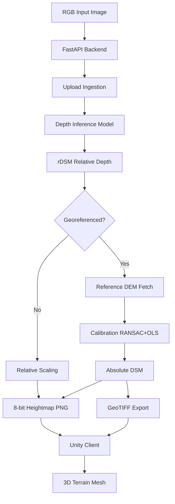
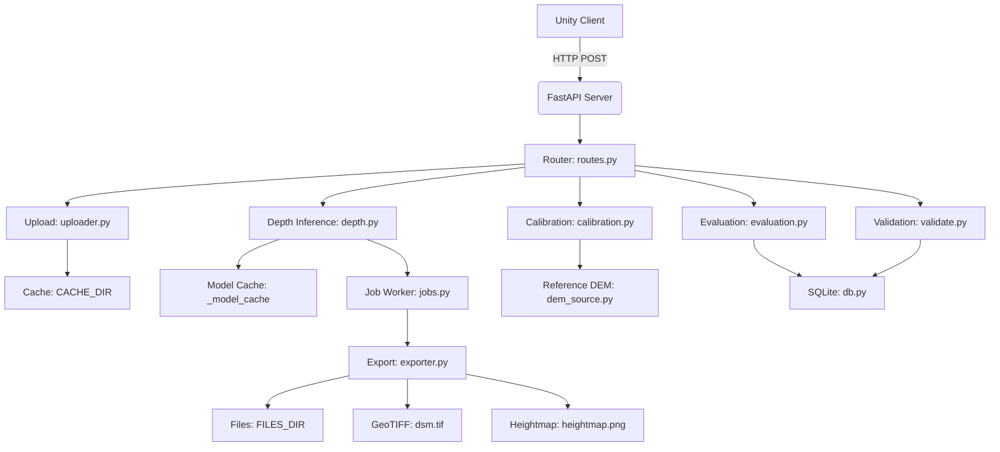

# DepthWizard — Technical Documentation

## 1. Project Overview

DepthWizard is an image-to-terrain pipeline that generates georeferenced digital elevation models (DEMs) from ordinary RGB photographs using AI depth estimation. The system takes a single image as input, estimates relative depth using monocular vision models, calibrates the depth to metric elevation using a reference DEM, and exports the result as a georeferenced GeoTIFF. A Unity 3D client visualizes the generated terrain as an interactive 3D mesh.

**Problem being addressed:** Single-view height/elevation estimation from a single RGB image. A monocular camera cannot directly measure metric elevation — it produces relative depth (closer objects appear brighter). DepthWizard bridges this gap by calibrating relative depth against reference elevation data (SRTM/Copernicus DEMs) to produce absolute metric elevation.

**Intended workflow:** Upload an RGB image → the backend runs AI depth inference → calibration aligns relative depth to metric elevation using a reference DEM → export produces a georeferenced GeoTIFF → the Unity client renders the terrain as a 3D mesh.

**Current implementation status:** The current production/default pipeline uses the pix2pix GAN (`models/pix2pix`) as the default depth backend, with Depth Anything V2 (`LiheYoung/depth-anything-small-hf`) as the fallback when `DEPTHWIZARD_TF_MODEL=""` is set. IMELE and a fine-tuned DecoderHead are opt-in backends. The system is functional and documented, with CI tests passing on Python 3.10.

---

## 2. Problem Definition

### 2.1 Single-View Height/Elevation Estimation

A single RGB image lacks depth scale information. Monocular depth models produce **relative depth** — a 0..1 normalized surface where brighter = higher elevation. This relative depth is not physically meaningful in meters without calibration.

### 2.2 Relative Depth vs Metric Elevation

Relative depth (rDSM) is model-specific and scale-free. It preserves the shape of the terrain but not its absolute elevation. **Metric elevation** requires a scale factor and offset that relate the relative depth to known elevation values.

The project distinguishes these clearly:
- **Relative branch** (`rdsm`): Normalized 0..1 depth scaled to a legible meter range (`DEPTHWIZARD_RELIEF_M`, default 200m) for visualization. No real elevation.
- **Absolute branch** (`absolute_dsm`): Uses reference DEM calibration to produce true metric elevation in meters. Requires georeferenced input (CRS + bounds).

### 2.3 Role of Reference DEMs

Reference DEMs (SRTM 30m, Copernicus GLO-30) provide ground-truth elevation values used for:
- **Calibration**: Fitting scale/offset (RANSAC + OLS) to convert relative depth to metric elevation
- **Evaluation**: Computing MAE/RMSE/Pearson correlation against known terrain
- **Validation**: Comparing the produced DSM against the same reference DEM

Reference DEMs are fetched automatically from OpenTopography (with optional API key) or Copernicus AWS, with disk caching. A local override via `DEPTHWIZARD_DEM_FILE` is supported for offline use.

---

## 3. Project Goals

### 3.1 Core Technical Goals
- Estimate relative depth from a single RGB image using monocular AI models
- Calibrate relative depth to metric elevation using reference DEMs
- Export georeferenced GeoTIFF DSMs with correct CRS and transform
- Provide a REST API for the full pipeline

### 3.2 Geospatial Goals
- Support GeoTIFF inputs with CRS and transform metadata
- Auto-fetch reference DEMs from OpenTopography/Copernicus
- Reproject and resample DEMs to match the input grid
- Preserve georeferencing through the entire pipeline

### 3.3 Visualization Goals
- Render 3D terrain in Unity with vertical exaggeration
- Support DEM overlay, display modes, and DSM export
- Provide a heightmap-based mesh with block extrusion

### 3.4 Validation Goals
- Compute MAE, RMSE, and Pearson correlation on held-out pixels
- Detect degenerate calibration (near-constant predictions, near-zero scale, negative scale)
- Report model polarity (whether the model output is inverted relative to the reference)
- Provide diff heatmap visualization

---

## 4. System Architecture

The complete architecture flows as follows:



### Architecture Components

| Component | Implementation | File Path |
|-----------|---------------|-----------|
| Backend API | FastAPI + Uvicorn | `server/app/main.py` |
| Upload ingestion | File validation, georeferencing detection | `server/app/pipeline/uploader.py` |
| Depth inference | pix2pix GAN / DA2 / IMELE / fine-tuned | `server/app/pipeline/depth.py` |
| Calibration | RANSAC + OLS affine | `server/app/pipeline/calibration.py` |
| Evaluation | MAE/RMSE/Pearson on held-out pixels | `server/app/pipeline/evaluation.py` |
| Validation | RMSE/MAE/Pearson with undefined-correlation policy | `server/app/pipeline/validate.py` |
| DEM source | OpenTopography / Copernicus / local | `server/app/pipeline/dem_source.py` |
| Export | PNG/EXR heightmap + GeoTIFF | `server/app/pipeline/exporter.py` |
| Job processing | Single-worker daemon thread | `server/app/jobs.py` |
| Database | SQLite (uploads, jobs, results, evaluations) | `server/app/db.py` |
| Configuration | Environment variables (`DEPTHWIZARD_*`) | `server/app/config.py` |
| Unity client | 3D terrain viewer | `unity-client/Assets/Scripts/` |

---

## 5. End-to-End Pipeline

### 5.1 Input Ingestion

The `/upload` endpoint accepts PNG, JPG, or GeoTIFF files. `server/app/pipeline/uploader.py` validates the file type, detects geospatial metadata (CRS + transform), and downsizes oversized images to `MAX_WORKING_DIM` (default 1024px). Georeferenced TIFFs are detected via `detect_georeferenced()` which requires both CRS and transform/bounds.

**Source:** `server/app/routes.py:33-54`, `server/app/pipeline/uploader.py:148-176`

### 5.2 Preprocessing

Uploaded images are persisted to `CACHE_DIR` and optionally downsampled to `MAX_WORKING_DIM`. GeoTIFFs retain their CRS and transform metadata; PNG/JPG files have no georeferencing and enter the relative branch.

**Source:** `server/app/pipeline/uploader.py:91-111`, `server/app/pipeline/uploader.py:148-176`

### 5.3 Model Selection

The depth model is selected by `_load_model()` in `server/app/pipeline/depth.py` based on configuration priority:
1. If `DEPTHWIZARD_FINETUNED_MODEL` is set → fine-tuned DA2 + DecoderHead
2. If `DEPTHWIZARD_IMELE_MODEL` is set → IMELE (SENet154)
3. If `DEPTHWIZARD_TF_MODEL` is set → pix2pix GAN (`_TfSavedModel`)
4. Otherwise → Depth Anything V2 (`LiheYoung/depth-anything-small-hf`)

**Default backend is pix2pix GAN** (`models/pix2pix`). Set `DEPTHWIZARD_TF_MODEL=""` to force Depth Anything V2.

**Source:** `server/app/pipeline/depth.py:226-249`, `server/app/config.py:37-50`

### 5.4 Depth/Height Inference

The selected model produces a relative depth map. For the pix2pix GAN, the output is the generator's tanh in [-1,1] (brighter = higher elevation, no sign inversion). For Depth Anything V2, the model outputs inverse depth which is inverted so brighter = higher elevation. All outputs are normalized to 0..1 (rDSM).

The pix2pix GAN runs at a fixed 512×512 grid and is resampled back to native resolution via LANCZOS. IMELE runs at 440×440. The fine-tuned model is fully-convolutional and accepts any resolution.

**Source:** `server/app/pipeline/depth.py:274-354`, `server/app/pipeline/depth.py:73-127`

### 5.5 Postprocessing

After inference, the rDSM is either:
- **Relative branch**: Scaled to `RELATIVE_ELEVATION_RANGE_M` meters (default 200) for visualization
- **Absolute branch**: Calibrated to metric elevation using RANSAC+OLS against a reference DEM

**Source:** `server/app/jobs.py:80-194`

### 5.6 DEM/Reference Handling

For the absolute branch, `server/app/pipeline/dem_source.py` fetches a reference DEM covering the upload's bounds. Primary source: OpenTopography (SRTM 30m). Fallback: Copernicus GLO-30 via AWS Open Data. Results are cached on disk keyed by (source, bounds, CRS). A local override via `DEPTHWIZARD_DEM_FILE` bypasses the network.

**Source:** `server/app/pipeline/dem_source.py:67-110`, `server/app/pipeline/dem_source.py:112-164`

### 5.7 Calibration

`server/app/pipeline/calibration.py` fits `elevation = scale * relative_depth + offset` via RANSAC + OLS. An 80/20 split reserves 20% of pixels purely for validation (never seen during fitting). RANSAC rejects outliers (buildings, vegetation). The negative scale is **flagged as a warning but never flipped** — `abs()` would fabricate a positive association the model does not have.

**Source:** `server/app/pipeline/calibration.py:87-260`

### 5.8 Evaluation

`server/app/pipeline/evaluation.py` computes MAE, RMSE, and Pearson correlation on the held-out 20% only. The `POST /evaluate` endpoint accepts a matched RGB + ground-truth DEM pair and reports metrics on held-out pixels. Correlation is scale-invariant and needs no calibration.

**Source:** `server/app/pipeline/evaluation.py:112-287`

### 5.9 Export

`server/app/pipeline/exporter.py` produces:
- `heightmap.png` — 8-bit grayscale PNG for Unity mesh generation
- `texture.png` — Source RGB texture
- `dsm.tif` — GeoTIFF with CRS/transform (absolute branch only)
- `dsm_export.tif` — Downloadable, traceability-tagged copy with model metadata

**Source:** `server/app/pipeline/exporter.py`

### 5.10 Unity Visualization

The Unity client (`ServerManager.cs`) starts the FastAPI server, then the viewer (`ViewerScreen.cs`) fetches the heightmap and renders it as a 3D mesh via `MeshGenerator.cs`. The mesh uses `verticalExaggeration=3.0` and `extrudeAsBlock=true`.

**Source:** `unity-client/Assets/Scripts/Core/ServerManager.cs`, `unity-client/Assets/Scripts/Mesh/MeshGenerator.cs`

---

## 6. Input and Output Formats

### 6.1 Supported Input Formats

| Format | Extension | Georeferenced | Details |
|--------|-----------|---------------|---------|
| PNG | `.png` | No | RGB image, converted to uint8 |
| JPG | `.jpg`, `.jpeg` | No | RGB image, converted to uint8 |
| GeoTIFF | `.tif`, `.tiff` | Yes (if CRS+transform present) | Float32 single-band or RGB |

**Source:** `server/app/pipeline/uploader.py:20`, `server/app/pipeline/uploader.py:31-39`

### 6.2 Generated Output Files

| File | Format | Relative/Metric | Georeferenced | Branch |
|------|--------|-----------------|---------------|--------|
| `heightmap.png` | 8-bit grayscale PNG | Relative (0..255) | No | All |
| `texture.png` | 8-bit RGB PNG | N/A | No | All |
| `dsm.tif` | Float32 GeoTIFF | Metric (meters) | Yes | Absolute |
| `dsm_export.tif` | Float32 GeoTIFF (deflate) | Metric (meters) | Yes | Absolute |
| `diff_heatmap.png` | 8-bit RGB PNG | N/A | No | After `/validate` |
| `comparison.png` | 8-bit RGB PNG | N/A | No | After `/evaluate` |
| `predicted_depth.npy` | NumPy float32 | Calibrated or relative | Depends | After `save_artifacts` |
| `metrics.json` | JSON | N/A | N/A | After `save_artifacts` |
| `held_out.npz` | NumPy `.npz` | N/A | No | After absolute job |

**Source:** `server/app/pipeline/exporter.py`, `server/app/pipeline/artifacts.py`

### 6.3 Not Supported

- 16-bit PNG heightmaps (Unity's `DownloadHandlerTexture` is unreliable)
- Non-PNG/JPG/TIFF inputs
- GeoTIFF inputs without CRS/transform are treated as relative

---

## 7. AI / Height Estimation Models

### 7.1 Depth Anything V2

- **Purpose:** Final fallback depth estimation model. Monocular depth estimation via transformers.
- **Source code:** `server/app/pipeline/depth.py` (lines 226-249, 309-354), `server/app/pipeline/decoder_head.py`
- **Model ID:** `LiheYoung/depth-anything-small-hf`
- **Loading mechanism:** `transformers.pipeline("depth-estimation", model=...)` lazy-loaded on first inference; cached globally
- **Input:** RGB image (uint8, any resolution; for the HF pipeline, the model internally processes at its native grid)
- **Output:** Inverse depth (near=brighter), which is **inverted** (`invert_depth=True`) so brighter = higher elevation
- **Preprocessing:** Normalized to 0..1 via `_normalize_01()`
- **Postprocessing:** Sign inversion applied (`depth * -1.0`) then 0..1 normalization
- **Configuration:** `DEPTHWIZARD_DEPTH_MODEL` env var (default: `LiheYoung/depth-anything-small-hf`), set `DEPTHWIZARD_TF_MODEL=""` to force this model
- **Model weight requirements:** Downloaded from HuggingFace on first run; requires network access
- **Status:** Fallback (used when `DEPTHWIZARD_TF_MODEL=""`)

### 7.2 IMELE

- **Purpose:** Building-height backbone; opt-in secondary model
- **Source code:** `server/app/pipeline/imele.py`, `server/app/pipeline/depth.py` (lines 130-172, 230-231)
- **Architecture:** SENet154 encoder + D2/MFF/R decoder
- **Loading mechanism:** `torch.load(checkpoint_path)` with `strict=False`; `E.Harm.*` keys dropped
- **Input:** 440×440 RGB image, normalized with ImageNet mean/std
- **Output:** Building height map (brighter = higher), no sign inversion
- **Preprocessing:** Resized to 440×440, normalized with `_IMAGENET_MEAN/STD`
- **Postprocessing:** No sign inversion; 0..1 normalization
- **Configuration:** `DEPTHWIZARD_IMELE_MODEL` env var (path to `Block0_skip_model_*.tar`); **strictly opt-in**, not auto-discovered
- **Model weight requirements:** 608 MB checkpoint file
- **Status:** Experimental/secondary

### 7.3 Pix2Pix / ImageToDEM

- **Purpose:** **Default backend** — TensorFlow SavedModel GAN trained to predict elevation from RGB
- **Source code:** `server/app/pipeline/depth.py` (lines 73-127, 226-234), `server/app/config.py:37-39`
- **Architecture:** U-Net generator with tanh output in [-1,1] (brighter = higher elevation)
- **Loading mechanism:** `tensorflow.saved_model.load(path)` with `serving_default` signature
- **Input:** RGB image at native resolution; resized to 512×512 for the U-Net skip connections, then resampled back via LANCZOS
- **Output:** Generator tanh in [-1,1] (brighter = higher elevation, `invert_depth=False`)
- **Preprocessing:** `(rgb / 127.5) - 1.0` training normalization; LANCZOS resize to 512×512 if needed
- **Postprocessing:** Squeeze only — no sign inversion (the GAN output is already in elevation convention)
- **Configuration:** `DEPTHWIZARD_TF_MODEL` env var (default: `models/pix2pix` relative to repo root); set `DEPTHWIZARD_TF_MODEL=""` to disable
- **Model weight requirements:** `models/pix2pix/` TensorFlow SavedModel (~800 MB)
- **Status:** **Current default production backend**

### 7.4 Fine-Tuned DecoderHead

- **Purpose:** Fourth backend — fine-tuned DA2-small + trained decoder head
- **Source code:** `server/app/pipeline/depth.py` (lines 175-223, 226-228), `server/app/pipeline/decoder_head.py`, `decoder_training/train_decoder.py`
- **Architecture:** Frozen DA2-small backbone + 4-layer conv stack (64→32→16→1)
- **Loading mechanism:** `AutoModelForDepthEstimation.from_pretrained(MODEL_ID)` + `torch.load(ckpt)` for decoder head
- **Input:** Any resolution RGB image
- **Output:** Elevation map (brighter = higher), no sign inversion
- **Preprocessing:** ImageNet mean/std normalization via `AutoImageProcessor`
- **Postprocessing:** No sign inversion; 0..1 normalization
- **Configuration:** `DEPTHWIZARD_FINETUNED_MODEL` env var (path to `.pt` checkpoint); strictly opt-in
- **Model weight requirements:** DA2-small HF weights + fine-tuned decoder checkpoint
- **Training:** `decoder_training/train_decoder.py` — frozen DA2 + DecoderHead, L1 + Sobel gradient loss, 85/15 region split, `CROP=256`
- **Status:** Experimental/secondary

### 7.5 Perlin / Synthetic Data

- **Purpose:** Generate synthetic DEMs for training/visualization data
- **Source code:** `server/app/pipeline/perlin.py`
- **Algorithm:** Fractional Brownian motion with ridge noise, deterministic (seeded)
- **Input:** Size (256/512/1024), seed, octaves, ridge_weight
- **Output:** 0..1 float DEM, plus hillshade and RGB render
- **Usage:** Training data generation (`sample_images/test_landscape_dem.npz`), not used in production inference
- **Status:** Utility/training support only

---

## 8. Model Selection and Dispatch

The model selection logic is in `server/app/pipeline/depth.py` (`_load_model()` and `backend_slug()`):

| Priority | Condition | Backend |
|----------|-----------|---------|
| 1 | `DEPTHWIZARD_FINETUNED_MODEL` is set | Fine-tuned DA2 + DecoderHead |
| 2 | `DEPTHWIZARD_IMELE_MODEL` is set | IMELE (SENet154) |
| 3 | `DEPTHWIZARD_TF_MODEL` is set (and non-empty) | pix2pix GAN |
| 4 | Default | Depth Anything V2 (`LiheYoung/depth-anything-small-hf`) |

**Default is pix2pix GAN.** The pix2pix SavedModel ships in `models/pix2pix/`. Set `DEPTHWIZARD_TF_MODEL=""` to force Depth Anything V2 as the default.

The `backend_slug()` function derives the label from the loaded model's class name: `_TfSavedModel` → `"pix2pix"`, `_ImeleModelBackend` → `"imele"`, `_FinetunedDepthBackend` → `"finetuned"`, otherwise `"depth_anything"`.

**Source:** `server/app/pipeline/depth.py:36-59`, `server/app/pipeline/depth.py:226-249`

---

## 9. Geospatial and DEM Processing

### 9.1 Rasterio/GDAL Usage

All geospatial operations use `rasterio`. GeoTIFF inputs are read via `rasterio.open()` preserving CRS, transform, bounds, and dimensions. DEM fetching uses `rasterio.MemoryFile` for network responses and `rasterio.open()` for cached `.npz` files.

**Source:** `server/app/pipeline/uploader.py:42-63`, `server/app/pipeline/dem_source.py`

### 9.2 CRS

CRS is stored as a string (e.g., `"EPSG:32633"`). Georeferencing requires both a CRS and a transform/bounds. Geographic CRS (EPSG:4326) is detected via `rasterio.crs.CRS.is_geographic`. The `/export-dsm` endpoint rejects relative (non-georeferenced) jobs with a 400 error.

**Source:** `server/app/pipeline/uploader.py:86-88`, `server/app/pipeline/exporter.py:153-157`

### 9.3 Transforms and Bounds

Transform is stored as a `rasterio.transform.Affine` object. Bounds are `[minx, miny, maxx, maxy]`. World dimensions in meters are computed in `exporter.compute_world_dimensions()`: geographic CRS uses `111320 m/deg lat` and `111320*cos(lat) m/deg lon`; projected CRS uses `width * cell_size`.

**Source:** `server/app/pipeline/exporter.py:130-150`

### 9.4 Resolution and Reprojection

When the reference DEM grid differs from the prediction grid, `calibration.resample_to_grid()` resamples via bilinear interpolation through Pillow. For evaluation, `evaluation.align_dem_to_prediction()` uses `rasterio.warp.reproject` with bilinear resampling, guarded by georeferencing metadata on both inputs.

**Source:** `server/app/pipeline/calibration.py:372-391`, `server/app/pipeline/evaluation.py:64-109`

### 9.5 Nodata Handling

Nodata values from reference DEMs are handled in `evaluation.build_valid_mask()` — pixels matching the nodata value are excluded from metrics. `dem_source.fetch_reference_dem()` returns NaN for areas outside the DEM extent.

**Source:** `server/app/pipeline/evaluation.py:51-61`, `server/app/pipeline/dem_source.py:286-319`

### 9.6 Georeferencing and Metadata Preservation

GeoTIFF exports preserve the original upload's CRS and transform via `exporter.export_geotiff()`. The `/export-dsm` endpoint produces a traceability-tagged copy with GDAL metadata (SOURCE, MODEL, BACKEND, JOB_ID, INPUT, VERTICAL_EXAGGERATION="none", MIN_ELEVATION_M, MAX_ELEVATION_M).

**Source:** `server/app/pipeline/exporter.py:77-95`, `server/app/pipeline/exporter.py:97-127`

---

## 10. Calibration

### 10.1 Method

Calibration fits `elevation = scale * relative_depth + offset` using RANSAC + OLS on matching pixels. An 80/20 split reserves 20% for validation (never seen during fitting). RANSAC uses `sklearn.linear_model.RANSACRegressor` with `LinearRegression` as the estimator and `min_samples=8`. After RANSAC identifies inliers, OLS is refit on the inliers and on the full training split.

**Source:** `server/app/pipeline/calibration.py:87-260`

### 10.2 Scale and Offset

The fitted `scale` and `offset` are returned as `CalibrationFit`. The scale is the pixel-to-meter conversion factor. The offset is the elevation at zero relative depth.

### 10.3 Robust Fitting

RANSAC rejects outliers (buildings, vegetation, clouds). If RANSAC and OLS disagree on sign, OLS sign of the full training split is trusted and `RANSAC_SIGN_DISAGREEMENT` is flagged.

### 10.4 Calibration Warnings

| Warning | Trigger | Behavior |
|---------|---------|----------|
| `negative_scale` | Fitted scale < 0 | Scale reported unchanged, never flipped |
| `prediction_near_constant` | Prediction std < `MIN_RELATIVE_STD` * reference std | Fit is valid but semantically suspicious |
| `near_zero_scale` | Predicted span < 2% of reference terrain range | Returns constant elevation (flat result) |
| `insufficient_variance` | RANSAC fails on degenerate training data | Returns constant fit |
| `ransac_sign_disagreement` | RANSAC and OLS signs differ | OLS sign used, warning flagged |

**Source:** `server/app/pipeline/calibration.py:43-48`, `server/app/pipeline/calibration.py:227-260`

### 10.5 Negative-Scale Handling

**Negative scale is never flipped.** `abs()` would fabricate a positive association the model does not have. A negative scale is flagged as `negative_scale` and the raw signed correlation is reported so the caller can detect inversion.

### 10.6 Degenerate Predictions and Insufficient Variance

If the training 80% has no variance (constant prediction), a degenerate constant fit (`scale=0`, `offset=median(reference)`) is returned with `calibration_status="degenerate"`. If the predicted span is too small relative to the terrain range, `near_zero_scale` triggers a similar degenerate result.

### 10.7 Failure Conditions

- Fewer than 16 valid sample pairs → `ValueError("Not enough valid sample pairs for calibration")`
- No bounds/CRS on georeferenced upload → `ValueError("Georeferenced upload is missing bounds/CRS")`
- RANSAC fails on degenerate data → constant fit returned

**Source:** `server/app/pipeline/calibration.py:102-103`, `server/app/pipeline/calibration.py:136-175`, `server/app/pipeline/calibration.py:203-225`

### 10.8 Why Calibration Does Not Mean Physical Correctness

Calibration fits a linear model to the relationship between model output and reference elevation. This does not guarantee the model prediction is physically correct:
- A negative scale means the model output is inverted relative to the reference
- A near-zero scale means the prediction has no meaningful variation
- The calibration is only as good as the reference DEM and the model's ability to distinguish elevation
- The project explicitly warns: "Calibration does not automatically mean the model prediction is physically correct"

---

## 11. Evaluation and Validation

### 11.1 Implemented Metrics

| Metric | What it Measures | Where Calculated |
|--------|-----------------|------------------|
| MAE | Mean absolute error (meters) | `/validate`, `/evaluate` |
| RMSE | Root mean square error (meters) | `/validate`, `/evaluate` |
| Pearson correlation | Linear correlation coefficient | `/validate`, `/evaluate` |

**Source:** `server/app/pipeline/validate.py:57-74`, `server/app/pipeline/evaluation.py:287`

### 11.2 Correlation Policy

- `r == 0` means "zero LINEAR correlation" — a real, reportable number
- An **undefined** correlation (zero variance on either side, or fewer than 2 samples) returns `None` with an explicit `correlation_reason` — never collapsed into `0.0`
- This is implemented in `validate.correlation_and_reason()` and shared by both `/evaluate` and `/validate`

**Source:** `server/app/pipeline/validate.py:31-54`

### 11.3 Validation Trigger

- `/validate/{job_id}` — Compares the produced absolute DSM against the reference DEM fetched during processing. Uses the held-out 20% from calibration (never the training 80%).
- `/evaluate` — Accepts a matched RGB + ground-truth DEM pair. Fits calibration on 80% of valid pixels, reports metrics on held-out 20%.

**Source:** `server/app/routes.py:194-211`, `server/app/routes.py:246-358`

### 11.4 Invalid/Degenerate Predictions

- Zero variance on either side → correlation undefined (`None` with reason)
- Fewer than 2 valid pixels → correlation undefined
- Degenerate calibration → correlation reported as raw relative-depth only, `degenerate_calibration=True`
- Fewer than 16 valid pixels → calibration not possible, raw correlation only

**Source:** `server/app/pipeline/evaluation.py:169-235`, `server/app/pipeline/validate.py:44-54`

### 11.5 Sign-Inversion / Calibration Hazard

**The project has a known sign-inversion/calibration hazard.** When the fitted calibration scale is negative, the model output is inverted relative to the reference. The negative scale is **flagged but never flipped**. This means:
- Calibrated MAE/RMSE may be reported with flipped polarity
- The `raw_correlation_signed` field gives the unflipped model signal
- `polarity_inverted=True` indicates the model signal is clearly inverted (raw correlation < -0.25)
- `tools/score_my_data.py` uses a `SIGN-INVERTED` flag to handle negative predictions

**This hazard is documented explicitly and never hidden.**

**Source:** `server/app/pipeline/calibration.py:8-14`, `server/app/pipeline/calibration.py:52-53`, `tools/score_my_data.py`

---

## 12. Experimental Results

### 12.1 Pix2Pix Urban-Domain Behavior

**Observed:** Pix2pix produces negative correlation on urban tiles (inverted depth). This is documented in `17-imele-vs-pix2pix.md`.

**Status:** Observed in experimental evaluation.

### 12.2 Negative Raw Correlation

**Observed:** On certain terrain types, raw correlation between relative depth and reference elevation is negative. This triggers `polarity_inverted=True` when the train-split raw correlation is < -0.25.

**Status:** Observed in experimental evaluation.

### 12.3 Sign-Inversion Calibration Hazard

**Known limitation:** Negative calibration scale is detected but never flipped. This means calibrated MAE/RMSE can be misleading when the model output is inverted.

**Status:** Documented design decision, not a bug.

### 12.4 Cross-Domain Generalization

**Observed:** DA2 performs better on hilly terrain than pix2pix. IMELE shows negative scale warnings on certain terrain types. Training data is stratified by hilly/forested/sparse domains.

**Status:** Documented in `14-evaluation-results.md` and `15-depth-diagnosis.md`.

### 12.5 Small Training-Set Limitations

**Known limitation:** Training set may have fewer than 50 valid pairs (warning in `gather_training.py`). Region-based split (not pixel-based) prevents leakage but the total dataset size may be small.

**Status:** Known limitation, documented in `gather_training.py:289-291`.

### 12.6 Legend for Result Labels

- **Verified:** Confirmed by test execution or code inspection
- **Observed:** Documented in experimental results (`14-evaluation-results.md`, `17-imele-vs-pix2pix.md`)
- **Experimental:** In `tools/` or `decoder_training/`, not production
- **Known limitation:** Explicitly documented in source or design docs

---

## 13. Datasets and Reference Sources

### 13.1 OpenTopography SRTM

- **Purpose:** Primary reference DEM source for calibration and validation
- **Type:** SRTM 30m elevation data
- **Acquisition:** Free API via `https://portal.opentopography.org/API/globaldem` (optional API key)
- **Role:** Reference elevation for calibration and evaluation
- **Source:** `server/app/pipeline/dem_source.py:112-164`

### 13.2 Copernicus GLO-30 (AWS)

- **Purpose:** No-auth fallback when OpenTopography returns 401
- **Type:** GLO-30 DEM (10m resolution)
- **Acquisition:** Public AWS S3 bucket (`copernicus-dem-30m.s3.amazonaws.com`)
- **Role:** Reference elevation fallback
- **Source:** `server/app/pipeline/dem_source.py:201-283`

### 13.3 Training Data

- **Purpose:** Fine-tuned decoder training
- **Type:** RGB + DEM pairs stratified by hilly, forested, sparse domains
- **Acquisition:** `gather_training.py` — COP30 DEM via OpenTopography + Esri World Imagery
- **Location:** `training_data/{stratum}/`
- **Role:** Training and evaluation for fine-tuned decoder
- **Exclusions:** Held-out sites (colorado_original, colorado_north, etc.) never in training data
- **Source:** `gather_training.py`, `decoder_training/train_decoder.py`

### 13.4 Synthetic Data (Perlin)

- **Purpose:** Training/visualization data generation
- **Type:** Deterministic fBm DEM + hillshaded RGB
- **Source:** `server/app/pipeline/perlin.py`
- **Role:** Not used in production inference

### 13.5 Sample Images

- **Purpose:** Testing and demonstration
- **Location:** `sample_images/`
- **Files:** `test_landscape.png`, `test_landscape_dem.npz`, `gamus_test/`
- **Source:** Included in repository

**Note:** No dataset licenses are claimed. Pretrained model weights (Depth Anything V2, IMELE, pix2pix) remain subject to their respective licenses.

---

## 14. Training and Fine-Tuning

### 14.1 Dataset Preparation

`gather_training.py` collects RGB + DEM pairs:
- **Source:** COP30 DEM via OpenTopography + Esri World Imagery
- **Strata:** hilly, forested, sparse
- **Boxes:** 0.2° bounding boxes, deterministic spread
- **Exclusions:** `EXCLUDED` list prevents held-out sites from entering training data
- **Fallback:** Tilezen/AWS terrain-tiles when OpenTopography quota is exhausted
- **Manifest:** `training_data/manifest.csv` with validation status
- **Command:** `python gather_training.py` (requires `OPENTOPO_API_KEY`)

**Source:** `gather_training.py`

### 14.2 RGB/DEM Pairing

Pairs are pixel-aligned. DEMs are fetched via OpenTopography; RGBs are fetched from Esri World Imagery at zoom 13. Each pair is validated for shape match and non-empty data.

### 14.3 Training Script

`decoder_training/train_decoder.py`:
- **Architecture:** Frozen DA2-small backbone + DecoderHead (4 conv layers: 1→64→32→16→1)
- **Loss:** L1 + 0.5 * Sobel gradient-magnitude L1 (edge sharpness)
- **Split:** 85/15 by region (not pixel) to prevent leakage
- **Crop:** `CROP=256`
- **Optimizer:** Adam (lr=3e-4 default)
- **Checkpoint:** `decoder_training/checkpoints/da2_decoder_finetuned.pt`
- **Best model:** Saved by lowest validation loss
- **Command:** `python decoder_training/train_decoder.py --epochs 30`
- **Source:** `decoder_training/train_decoder.py`

### 14.4 Model Architecture (Fine-Tuned)

- **Backbone:** Frozen `LiheYoung/depth-anything-small-hf` (Depth Anything V2 small)
- **Decoder:** 4-layer conv stack (`server/app/pipeline/decoder_head.py`)
- **Initialization:** Kaiming normal on conv weights, zeros on biases
- **Input:** Per-tile min-max normalized DEM in 0..1 (matching rDSM convention)
- **Loss:** L1(pred, target) + 0.5 * L1(sobel(pred), sobel(target))

### 14.5 Evaluation Script

`decoder_training/eval_finetuned.py`:
- Evaluates fine-tuned models on held-out sites
- Uses `DEPTHWIZARD_FINETUNED_MODEL` env var
- **Source:** `decoder_training/eval_finetuned.py`

### 14.6 How Trained Weights Are Loaded by Inference

When `DEPTHWIZARD_FINETUNED_MODEL` is set to the `.pt` checkpoint path, `server/app/pipeline/depth.py` loads it via `_FinetunedDepthBackend`:
1. `AutoImageProcessor.from_pretrained(MODEL_ID)` for preprocessing
2. `AutoModelForDepthEstimation.from_pretrained(MODEL_ID)` for frozen backbone
3. `DecoderHead()` + `torch.load(ckpt)` for the trained decoder
4. Inference runs at native resolution (fully-conv)

**Source:** `server/app/pipeline/depth.py:175-223`

---

## 15. Backend Architecture

### 15.1 FastAPI Application

**Entry point:** `server/app/main.py`
- Creates FastAPI app with `title="DepthWizard Inference Server"`, `version="0.1.0"`
- CORS middleware (`allow_origins=["*"]`) for Unity client
- Lifespan events: `config.ensure_dirs()`, `db.init_db()`, `jobs.start_worker()`
- Includes the API router

**Source:** `server/app/main.py`

### 15.2 Uvicorn

The server runs via Uvicorn. The Unity client starts it via `ServerManager.cs` with the command:
```
- m uvicorn app.main:app --host 127.0.0.1 --port 8000
```

**Source:** `unity-client/Assets/Scripts/Core/ServerManager.cs:45`

### 15.3 Application Entry Point

`server/app/main.py:23` — `app = FastAPI(...)` with lifespan, CORS, and router inclusion.

### 15.4 Routes

All API routes are defined in `server/app/routes.py` via `APIRouter()`:

| Method | Route | Purpose |
|--------|-------|---------|
| GET | `/health` | Health check |
| POST | `/upload` | Upload RGB image, create job |
| GET | `/preview/{upload_id}` | Low-res PNG thumbnail |
| POST | `/process/{upload_id}` | Trigger depth estimation |
| GET | `/status/{job_id}` | Job status and progress |
| GET | `/result/{job_id}` | Get processing results |
| GET | `/dem-view/{job_id}` | Grayscale DEM overlay PNG |
| GET | `/export-dsm/{job_id}` | Downloadable GeoTIFF |
| GET | `/validate/{job_id}` | Validate against reference DEM |
| POST | `/evaluate` | Evaluate RGB + DEM pair |
| GET | `/files/{job_id}/{filename}` | Static file serving |

**Source:** `server/app/routes.py`

### 15.5 Schemas

Pydantic models in `server/app/schemas.py`: `UploadResponse`, `ProcessResponse`, `StatusResponse`, `ResultResponse`, `ValidationResponse`, `EvaluationResponse`, `HealthResponse`, `ErrorResponse`.

**Source:** `server/app/schemas.py`

### 15.6 Configuration

Environment variables prefixed `DEPTHWIZARD_*` in `server/app/config.py`. Key defaults:
- `HOST`: `127.0.0.1`, `PORT`: `8000`
- `MAX_WORKING_DIM`: `1024`
- `RELATIVE_ELEVATION_RANGE_M`: `200`
- `MIN_RELATIVE_STD`: `0.05`
- `DEFAULT_DEPTH_MODEL`: `LiheYoung/depth-anything-small-hf`
- `OUTPUT_DIR`: `server/outputs/`

**Source:** `server/app/config.py`

### 15.7 File Handling

Uploaded files are persisted to `CACHE_DIR` (UUID-named). Per-job output bundles are served from `FILES_DIR` (`/files/{job_id}/`). Static file serving enforces path traversal protection.

**Source:** `server/app/routes.py:362-370`, `server/app/config.py`

### 15.8 Job Processing

Single-worker daemon thread (`server/app/jobs.py`). Jobs are queued in SQLite and processed sequentially. Progress tracked in `_STAGE_PROGRESS` dict: `loading` (0.05), `running_depth_model` (0.5), `calibrating` (0.7), `building_terrain` (0.9), `done` (1.0).

**Source:** `server/app/jobs.py`

### 15.9 Errors

`server/app/errors.py` defines `DepthWizardError` with `error_code` and `message`. Routes catch these and return `HTTPException(status_code=400)` with `ErrorResponse`.

### 15.10 Database

SQLite via `server/app/db.py`. Tables: `uploads`, `jobs`, `results`, `evaluation_results`. All methods synchronous. Foreign keys enabled.

**Schema:**
```sql
CREATE TABLE uploads (id, original_filename, file_path, file_type, is_georeferenced, crs, bounds, created_at);
CREATE TABLE jobs (id, upload_id, status, branch, error_message, started_at, completed_at);
CREATE TABLE results (id, job_id, heightmap_path, texture_path, dsm_geotiff_path, min_elev, max_elev, cell_size, world_width, world_depth);
CREATE TABLE evaluation_results (id, result_id, reference_source, landscape_type, rmse, mae, correlation);
```

**Source:** `server/app/db.py:17-61`

### 15.11 Architecture Diagram



---

## 16. API Reference

### 16.1 GET /health

- **Returns:** `{"status": "ok"}`
- **Source:** `server/app/routes.py:28-30`

### 16.2 POST /upload

- **Request:** `multipart/form-data` with `file` field
- **Supported types:** PNG, JPG, GeoTIFF
- **Response:** `UploadResponse` (`upload_id`, `is_georeferenced`, `crs`, `bounds`)
- **Errors:** 400 for corrupt/unsupported files
- **Source:** `server/app/routes.py:33-54`

### 16.3 GET /preview/{upload_id}

- **Returns:** 8-bit PNG thumbnail (max 256px)
- **Purpose:** Unity file-picker preview; cosmetic only
- **Source:** `server/app/routes.py:57-72`

### 16.4 POST /process/{upload_id}

- **Request:** None
- **Response:** `ProcessResponse` (`job_id`, `status="queued"`)
- **Branch:** `"absolute_dsm"` if georeferenced, `"rdsm"` otherwise
- **Source:** `server/app/routes.py:75-84`

### 16.5 GET /status/{job_id}

- **Response:** `StatusResponse` (`job_id`, `status`, `progress`, `stage`)
- **Source:** `server/app/routes.py:87-98`

### 16.6 GET /result/{job_id}

- **Response:** `ResultResponse` (`heightmap_url`, `texture_url`, `dsm_geotiff_url`, `min_elev`, `max_elev`, `cell_size`, `world_width`, `world_depth`, `is_georeferenced`)
- **Errors:** 404 if job not found, 409 if not done
- **Source:** `server/app/routes.py:101-126`

### 16.7 GET /dem-view/{job_id}

- **Returns:** Grayscale DEM overlay PNG (true-scale, no exaggeration)
- **Errors:** 404 if job not found, 409 if not done
- **Source:** `server/app/routes.py:129-152`

### 16.8 GET /export-dsm/{job_id}

- **Returns:** Downloadable GeoTIFF with model-estimated metadata tags
- **Errors:** 400 if not a georeferenced job (`dsm_export_requires_georeferenced`)
- **Source:** `server/app/routes.py:155-191`

### 16.9 GET /validate/{job_id}

- **Query param:** `save_artifacts` (bool, default false)
- **Response:** `ValidationResponse` (`reference_source`, `rmse`, `mae`, `correlation`, `correlation_reason`, `degenerate_calibration`, `calibration_status`, `calibration_warning`, `calibration_scale`, `calibration_offset`, `raw_correlation_signed`, `scale_sign`, `polarity_inverted`, `polarity_reason`, `diff_heatmap_url`, `held_out_pixel_count`)
- **Source:** `server/app/routes.py:194-211`

### 16.10 POST /evaluate

- **Request:** `image` + `dem` files, `mode` ("calibrated"|"relative"), `include_visualization`, `save_artifacts`
- **Response:** `EvaluationResponse` (`mae`, `rmse`, `correlation`, `correlation_reason`, `valid_pixels`, `total_pixels`, `held_out_pixel_count`, `calibrated`, `evaluated_units`, `degenerate_calibration`, `calibration_*`, `raw_correlation_signed`, `scale_sign`, `polarity_inverted`, `polarity_reason`, `comparison_image_url`)
- **Source:** `server/app/routes.py:246-358`

### 16.11 GET /files/{job_id}/{filename}

- **Returns:** Static file (heightmap.png, texture.png, dsm.tif, etc.)
- **Path traversal protection:** Enforces target within base directory
- **Source:** `server/app/routes.py:362-370`

### 16.12 Response Schemas

| Schema | Fields |
|--------|--------|
| `HealthResponse` | `status` |
| `UploadResponse` | `upload_id`, `is_georeferenced`, `crs`, `bounds` |
| `ProcessResponse` | `job_id`, `status` |
| `StatusResponse` | `job_id`, `status`, `progress`, `stage` |
| `ResultResponse` | `heightmap_url`, `texture_url`, `dsm_geotiff_url`, `min_elev`, `max_elev`, `cell_size`, `world_width`, `world_depth`, `is_georeferenced` |
| `ValidationResponse` | See section 16.9 |
| `EvaluationResponse` | See section 16.10 |
| `ErrorResponse` | `error`, `message` |

**Source:** `server/app/schemas.py`

---

## 17. Unity Architecture

### 17.1 Unity Version

Unity 6 (6000.3.11f1), URP installed but built-in pipeline active.

**Source:** `server/DEPLOYMENT.md`, `AGENTS.md`

### 17.2 Scenes

- **Main scene:** `unity-client/Assets/Scenes/main.unity`

### 17.3 UI

- **ViewerScreen.cs:** DEM overlay rendering, display modes, validation UI, DSM export UI
- **MinimalButtonHover.cs:** Button hover UI
- **DsmExportUI.cs:** DSM export UI

### 17.4 ServerManager

`unity-client/Assets/Scripts/Core/ServerManager.cs`:
- Manages server lifecycle (start/stop)
- Starts Uvicorn via `Process.Start` with `"-m uvicorn app.main:app --host 127.0.0.1 --port {_port}"`
- Health checks via `UnityWebRequest` to `http://127.0.0.1:{port}/health`
- Finds server executable from: StreamingAssets > dev `.venv`/PATH
- `_port` defaults to 8000

### 17.5 API Client

`unity-client/Assets/Scripts/Core/DepthWizardApi.cs`:
- `Upload()`, `Process()`, `GetStatus()`, `GetResult()`, `Validate()`, `ExportDsm()`, `HealthCheck()`, `DownloadTexture()`
- Uses `UnityWebRequest` with JSON serialization via `JsonUtility`
- Timeout values: upload 120s, process 30s, status 10s, result 10s, validate 120s, export 60s

### 17.6 Upload Workflow

1. `DepthWizardApi.Upload()` sends file via `UnityWebRequest.Post`
2. `ServerManager.FindServerExecutable()` locates the Python server
3. `ServerManager.StartServer()` launches Uvicorn
4. Health check confirms server is ready
5. `Upload()` sends the image file

### 17.7 Processing Workflow

1. `DepthWizardApi.Process(uploadId)` triggers processing
2. Poll `GetStatus(jobId)` until status is `"done"` or `"failed"`
3. `GetResult(jobId)` retrieves output URLs
4. `DownloadTexture()` fetches the heightmap

### 17.8 Viewer

`unity-client/Assets/Scripts/Core/ViewerScreen.cs`:
- DEM overlay rendering
- Display mode switching
- Validation UI
- DSM export triggers

### 17.9 Settings

- `_port`: Server port (default 8000)
- `_healthCheckInterval`: 0.5s
- `_maxHealthRetries`: 60

### 17.10 Validation

- `Validate(jobId)` fetches calibration metrics
- `degenerate_calibration` flag surfaces calibration health
- `polarity_inverted` indicates model signal inversion

### 17.11 Export

- `ExportDsm(jobId)` downloads the GeoTIFF
- `DsmExportUI.cs` provides UI controls

### 17.12 Camera

Camera control scripts in `unity-client/Assets/Scripts/Camera/`.

### 17.13 Shader and Material Notes

- URP shaders render magenta unless URP is the active pipeline
- `MeshGenerator.cs` selects shader based on `GraphicsSettings.defaultRenderPipeline`
- Falls back to `Standard` then `Sprites/Default`
- Wall material uses `_WallColor` (dark earth-brown)

**Source:** `unity-client/Assets/Scripts/Mesh/MeshGenerator.cs:216-248`

---

## 18. 3D Terrain Generation

### 18.1 Heightmap-to-Mesh Conversion

`unity-client/Assets/Scripts/Mesh/MeshGenerator.cs` (`Build()` method):
1. Samples the heightmap texture at stride intervals
2. Maps grayscale values to elevation via `Mathf.Lerp(minElev, maxElev, t)`
3. Applies `SmoothHeights()` with 2 passes of 3×3 averaging

### 18.2 Vertex Heights

Vertices are placed at `(nx * worldWidth, wy, ny * worldDepth)` where `wy = heights[i] * verticalExaggeration`.

### 18.3 Vertical Exaggeration

`public float verticalExaggeration = 3.0f` — display-only scaling applied to vertex Y AFTER `SmoothHeights`. Never feeds the server or metrics. The HUD raycast divides back by this factor.

### 18.4 Smoothing

`SmoothHeights()` applies 2 passes of 3×3 box averaging (`passes=2`).

### 18.5 Mesh Extrusion

When `extrudeAsBlock = true` (default), `ExtrudeToBlock()` creates a solid block:
- Top surface (submesh 0)
- Vertical side walls (submesh 1)
- Flat bottom cap (submesh 1)
- `baseDepth = 0.15f` — bottom cap depth as fraction of mesh height range
- Wall color: `_WallColor` (0.20, 0.18, 0.15)

### 18.6 Side Walls and Bottom Cap

Walls are generated by connecting each adjacent top perimeter vertex to its base counterpart. The bottom cap is a fan from a center vertex at `baseY = minTopY - yRange * baseDepth`. Triangle winding is oriented so face normals point outward/downward.

### 18.7 Materials and Shaders

- If `_terrainMaterial` is set: uses it for the top surface
- Otherwise: selects shader based on `GraphicsSettings.defaultRenderPipeline` (URP/Lit → Standard → Sprites/Default)
- Side material: `sideMaterial` if set, otherwise same shader with `_WallColor`
- Texture: Applied via `mat.SetTexture("_BaseMap", texture)`

### 18.8 MeshCollider

`MeshCollider` is added to the same GameObject as the mesh. `collider.sharedMesh = _mesh`.

### 18.9 Terrain Rendering

The mesh uses `MeshFilter` + `MeshRenderer` with the material. Wireframe mode toggles between the main mesh and a wireframe mesh built from triangle edges.

### 18.10 Camera Controls

Camera control scripts in `unity-client/Assets/Scripts/Camera/`.

**Source:** `unity-client/Assets/Scripts/Mesh/MeshGenerator.cs`

---

## 19. Configuration and Environment Variables

| Variable | Purpose | Default | Required |
|----------|---------|---------|----------|
| `DEPTHWIZARD_DATA` | Data directory path | `server/data/` | No |
| `DEPTHWIZARD_HOST` | Server host | `127.0.0.1` | No |
| `DEPTHWIZARD_PORT` | Server port | `8000` | No |
| `DEPTHWIZARD_MAX_DIM` | Max working dimension | `1024` | No |
| `DEPTHWIZARD_RELIEF_M` | Vertical relief (m) for relative branch | `200` | No |
| `DEPTHWIZARD_MIN_RELATIVE_STD` | Calibration health threshold | `0.05` | No |
| `DEPTHWIZARD_TF_MODEL` | pix2pix SavedModel path | `models/pix2pix` | No |
| `DEPTHWIZARD_DEPTH_MODEL` | Default DA2 model ID | `LiheYoung/depth-anything-small-hf` | No |
| `DEPTHWIZARD_IMELE_MODEL` | IMELE checkpoint path | `""` (opt-in) | No |
| `DEPTHWIZARD_FINETUNED_MODEL` | Fine-tuned decoder checkpoint | `""` (opt-in) | No |
| `DEPTHWIZARD_OUTPUT_DIR` | Artifact export root | `server/outputs/` | No |
| `DEPTHWIZARD_DEM_TIMEOUT` | DEM fetch timeout (s) | `30` | No |
| `DEPTHWIZARD_OPENTOPO_API_KEY` | OpenTopography API key | `""` | No |
| `DEPTHWIZARD_DEM_TILE_M` | Max reference tile width (m) | `5000` | No |
| `DEPTHWIZARD_DEM_FILE` | Local DEM file override | `""` | No |

**Source:** `server/app/config.py`

---

## 20. Installation

### 20.1 Prerequisites

- Git
- Python 3.10 (required: `>=3.10,<3.11`)
- uv package manager
- Unity 6 (6000.3.11f1) — optional, for 3D visualization
- TensorFlow (for pix2pix backend) — installed via uv

### 20.2 Clone

```bash
git clone git@github.com:Tron-xR/DepthWizard.git
cd DepthWizard
```

### 20.3 Dependency Installation

```bash
cd server
uv sync --frozen
```

This installs all dependencies from `server/uv.lock`, including FastAPI, Uvicorn, PyTorch 2.5.1, Transformers, rasterio, scikit-learn, Pillow, etc.

**Source:** `server/pyproject.toml`, `.github/workflows/python-package.yml`

### 20.4 Model Weights

The default pix2pix GAN ships in `models/pix2pix/`. If not present, download it or set `DEPTHWIZARD_TF_MODEL=""` to use Depth Anything V2 (requires network for HF weights).

For IMELE: place the 608 MB checkpoint at `models/imele_model.tar` or set `DEPTHWIZDER_IMELE_MODEL`.

For fine-tuned decoder: place the `.pt` checkpoint and set `DEPTHWIZARD_FINETUNED_MODEL`.

### 20.5 Unity

Open `unity-client` in Unity Hub. The Unity client connects to the server running on `127.0.0.1:8000`.

---

## 21. Running the System

### 21.1 Backend

**Dev mode:**
```bash
cd server
uv run uvicorn app.main:app --host 127.0.0.1 --port 8000
```

**Frozen executable (Windows):**
```bash
cd server
uv run pyinstaller packaging/depthwizard-server.spec --noconfirm
```
The frozen server is at `dist/depthwizard-server/depthwizard-server.exe`.

**Source:** `server/DEPLOYMENT.md`, `server/packaging/run_server.py`

### 21.2 Unity

In the Unity Editor: the scene `Assets/Scenes/main.unity` starts automatically. `ServerManager` locates and starts the Python server, then the viewer loads the heightmap.

**Build:** `File > Build Settings > Windows x64`, scenes = `Assets/Scenes/main.unity`. Or via CLI: `Unity.exe -batchmode -nographics -quit -projectPath unity-client -buildTarget Win64 -executeMethod BuildScript.BuildWindows`.

**Source:** `server/DEPLOYMENT.md`, `unity-client/Assets/Scripts/Core/ServerManager.cs`

### 21.3 Health Check

```powershell
Invoke-RestMethod http://127.0.0.1:8000/health
```
Returns `{"status": "ok"}`.

**Source:** `AGENTS.md`

### 21.4 Processing Workflow

1. Upload an image: `POST /upload` with PNG/JPG/GeoTIFF
2. Process: `POST /process/{upload_id}` → returns `job_id`
3. Poll status: `GET /status/{job_id}` until `"done"`
4. Get result: `GET /result/{job_id}` → returns URLs for heightmap, texture, DSM
5. Visualize in Unity: heightmap is downloaded and rendered as 3D terrain

**Source:** `server/app/routes.py`

### 21.5 Export

For georeferenced jobs: `GET /export-dsm/{job_id}` downloads a traceability-tagged GeoTIFF. Relative jobs receive a 400 error (`dsm_export_requires_georeferenced`).

**Source:** `server/app/routes.py:155-191`

---

## 22. Testing and CI

### 22.1 GitHub Actions CI

**File:** `.github/workflows/python-package.yml`

- **Triggers:** push/pull_request to `master`
- **Runner:** `ubuntu-latest`
- **Python:** `3.10` (single version, matrix `["3.10"]`)
- **Dependency management:** `uv sync --frozen` from `server/uv.lock`
- **Linting:** `uv run flake8 . --count --select=E9,F63,F7,F82 --show-source --statistics` + exit-zero comprehensive lint with `--max-complexity=10 --max-line-length=127`
- **Testing:** `uv run pytest` from `server/`
- **Excludes:** `server/.venv`, `.venv`, `unity-client/build`, `build`, `dist`, `unity-client/Assets/StreamingAssets`

**Source:** `.github/workflows/python-package.yml`

### 22.2 uv and uv.lock

- **uv:** Fast Python package manager. `uv sync --frozen` installs exact locked dependencies from `server/uv.lock`.
- **uv.lock:** Generated lock file with all pinned versions.
- **Index:** PyTorch from `https://download.pytorch.org/whl/cu124` (via `[[tool.uv.index]]`).
- **Index strategy:** `unsafe-best-match`

**Source:** `server/pyproject.toml`

### 22.3 Flake8

- **Version:** `>=7.0`
- **Config:** Excludes virtual environments and Unity asset directories
- **Line length:** 127 characters
- **Max complexity:** 10

**Source:** `server/pyproject.toml`, `.github/workflows/python-package.yml`

### 22.4 pytest

- **Version:** `>=8.0`
- **Config:** `testpaths = ["tests"]`, `addopts = "-q"`
- **Test framework:** pytest with `FastAPI.TestClient` for integration tests
- **Mocking:** `monkeypatch.setattr(depth, "infer_relative_dsm", fake_infer)` to avoid model downloads in tests
- **Test isolation:** `isolated_db` fixture creates a fresh SQLite database per test

**Source:** `server/pyproject.toml`, `server/tests/conftest.py`

### 22.5 Test Organization

- `server/tests/conftest.py` — Fixtures: `make_rgb_gradient`, `write_rgb_png`, `write_geotiff`, `isolated_db`
- `server/tests/test_api.py` — API integration tests (upload, process, preview, validate, export-dsm, evaluate)
- `server/tests/test_evaluation.py` — Evaluation metric tests
- `server/tests/test_calibration.py` — Calibration tests
- `server/tests/test_artifacts.py` — Artifact management tests
- `server/tests/test_depth_backend.py` — Depth backend tests
- `server/tests/test_finetuned_backend.py` — Fine-tuned backend tests
- `server/tests/test_absolute_branch.py` — Absolute branch tests
- `server/tests/test_correlation_policy.py` — Correlation policy tests

**Source:** `server/tests/`

### 22.6 Python Version Support

**Only Python 3.10 is supported.** The project declares `requires-python = ">=3.10,<3.11"`. CI runs on Python 3.10 only. Do not document Python 3.9 or 3.11 as supported.

**Source:** `server/pyproject.toml:6`, `.github/workflows/python-package.yml:20`

---

## 23. Output Artifacts

### 23.1 Per-Job Artifacts

| File | Type | Relative/Metric | Georeferenced | Location |
|------|------|-----------------|---------------|----------|
| `heightmap.png` | 8-bit grayscale PNG | Relative (0..255) | No | `server/data/files/{job_id}/` |
| `texture.png` | 8-bit RGB PNG | N/A | No | `server/data/files/{job_id}/` |
| `dsm.tif` | Float32 GeoTIFF | Metric (meters) | Yes | `server/data/files/{job_id}/` |
| `dsm_export.tif` | Float32 GeoTIFF (deflate) | Metric (meters) | Yes | Downloaded via `/export-dsm` |
| `diff_heatmap.png` | 8-bit RGB PNG | N/A | No | `server/data/files/{job_id}/` |
| `held_out.npz` | NumPy `.npz` | N/A | No | `server/data/files/{job_id}/` |

### 23.2 Artifact Export (save_artifacts=true)

When `save_artifacts=true` is passed to `/evaluate` or `/validate`, artifacts are written under `<OUTPUT_DIR>/<backend>/<job_id>/` or `<OUTPUT_DIR>/<backend>/<input-stem>/`:

| File | Description |
|------|-------------|
| `predicted_depth.npy` | Final prediction (calibrated absolute or relative), exact float32 |
| `raw_prediction.npy` | Stage A: model output on native grid, before inversion/normalization |
| `relative_prediction.npy` | Stage B: normalized 0..1 rDSM |
| `calibrated_prediction.npy` | Stage C: calibrated absolute metric (if calibration ran) |
| `predicted_depth.png` | Visualization only (robust percentile stretch) |
| `predicted_depth.tif` | Single-band float GeoTIFF sharing input CRS/transform |
| `metrics.json` | Full metrics, stats, and calibration health |

**Source:** `server/app/pipeline/artifacts.py`

### 23.3 Georeferencing

- `dsm.tif` and `predicted_depth.tif` are GeoTIFFs with CRS and transform from the original upload
- `heightmap.png` and `texture.png` are NOT georeferenced (8-bit PNG)
- `/export-dsm` produces a downloadable GeoTIFF with model-estimated metadata tags

---

## 24. Known Limitations

### 24.1 Sign-Inversion Calibration Hazard

When the fitted calibration scale is negative, the model output is inverted relative to the reference. The negative scale is flagged but **never flipped**. This means calibrated MAE/RMSE can be misleading. The `raw_correlation_signed` field gives the unflipped model signal. `tools/score_my_data.py` uses a `SIGN-INVERTED` flag to handle this.

**Source:** `server/app/pipeline/calibration.py:8-14`, `tools/score_my_data.py`

### 24.2 Pix2Pix Urban-Domain Weakness

Pix2pix produces negative correlation on urban tiles (inverted depth). This is an observed experimental finding documented in `17-imele-vs-pix2pix.md`.

**Status:** Observed in experimental evaluation.

### 24.3 Domain Gap

The models are trained on specific terrain types (hilly, forested, sparse). Cross-domain generalization may be poor. DA2 performs better on hilly terrain; pix2pix may struggle with certain domains.

**Status:** Known limitation, documented in experimental results.

### 24.4 Relative-Depth Ambiguity

Relative depth (rDSM) is scale-free. Without a reference DEM, the output has no physical meaning. The relative branch scales to `RELATIVE_ELEVATION_RANGE_M` (default 200m) purely for visualization — this is not real elevation.

### 24.5 Reference DEM Dependency

The absolute branch requires a reference DEM for calibration. Without one, the system falls back to the relative branch. DEM fetching requires network access (OpenTopography/Copernicus) unless a local override (`DEPTHWIZARD_DEM_FILE`) is provided.

### 24.6 Small Training-Set Risk

The training dataset may have fewer than 50 valid pairs (`gather_training.py:289-291`). Region-based splitting prevents leakage but the total dataset size may be small.

### 24.7 Single-Worker Behavior

The job processor is a single daemon thread (`server/app/jobs.py`). Only one job processes at a time. Concurrent uploads are queued.

### 24.8 Model Weight Requirements

The pix2pix GAN (`models/pix2pix/`) is ~800 MB. IMELE checkpoint is 608 MB. Depth Anything V2 weights must be downloaded from HuggingFace on first run (requires network). The fine-tuned decoder requires the `.pt` checkpoint.

### 24.9 Terrain/Domain Limitations

Calibration fails on flat/low-relief tiles (`near_zero_scale`, `degenerate`). Predictions near-constant are flagged. The system completes jobs but results may be semantically meaningless for degenerate cases.

### 24.10 Platform Caveats

- Frozen server is **Windows only** (~6.4 GB on disk)
- Console exe — Unity launches it hidden
- DA2 fallback requires network on first run to fetch HF weights
- Port 8000 must be free; a dev `uvicorn` instance may conflict

**Source:** `server/DEPLOYMENT.md`

---

## 25. Troubleshooting

### 25.1 Missing Model Weights

**Symptom:** `DepthModelError` on first inference.
**Fix:** Ensure `models/pix2pix/` exists, or set `DEPTHWIZARD_TF_MODEL=""` to use DA2 (requires network). For IMELE, place the checkpoint at `models/imele_model.tar`.

### 25.2 Backend Unavailable

**Symptom:** Unity health check fails after max retries.
**Fix:** Ensure the Python server is running at `127.0.0.1:8000`. Check `FindServerExecutable()` candidates in `ServerManager.cs`. Ensure port 8000 is not occupied by another `uvicorn` process.

### 25.3 Invalid Input

**Symptom:** 400 error with `corrupt_image` or `unsupported_file_type`.
**Fix:** Upload a valid PNG, JPG, or GeoTIFF. Verify the file is not corrupted.

### 25.4 Missing NumPy/Dependencies

**Symptom:** Import errors or `ModuleNotFoundError`.
**Fix:** Run `uv sync --frozen` in the `server/` directory. Ensure the correct Python 3.10 environment is active.

### 25.5 CI Dependency Installation

**Symptom:** `uv sync` fails.
**Fix:** Ensure `uv` is installed. The workflow uses `astral-sh/setup-uv@v3`. Verify `server/uv.lock` is up to date.

### 25.6 Python Version Mismatch

**Symptom:** CI fails or `uv` reports version incompatibility.
**Fix:** Use Python 3.10 exactly. The project requires `>=3.10,<3.11`. Do not use 3.9 or 3.11.

### 25.7 Unity Material/Shader Issues

**Symptom:** URP shaders render magenta.
**Fix:** Ensure URP is the active render pipeline. `MeshGenerator.cs` selects the shader based on `GraphicsSettings.defaultRenderPipeline`. Falls back to `Standard` then `Sprites/Default`.

### 25.8 Georeferencing Problems

**Symptom:** `/export-dsm` returns `dsm_export_requires_georeferenced`.
**Fix:** Upload a GeoTIFF with CRS and transform metadata. Non-georeferenced PNG/JPG files enter the relative branch which cannot export a DSM.

### 25.9 Calibration Failures

**Symptom:** `degenerate_calibration=True`, `calibration_warning` set.
**Fix:** The terrain may be too flat or the prediction too constant. Check `calibration_status` and `calibration_warning`. The job completes but results may be semantically meaningless.

### 25.10 TensorFlow/DLL Load Failures

**Symptom:** Frozen server fails with `DLL load failed while importing _ml_dtypes_ext`.
**Fix:** Ensure `ml_dtypes` is included in the PyInstaller spec. The `.spec` collects all `FROZEN_PACKAGES` including `ml_dtypes`.

**Source:** `server/DEPLOYMENT.md`, `server/packaging/depthwizard-server.spec`

---

## 26. Development History

### Stage 1: Initial Architecture (`c3af76e`)
- Core image-to-terrain pipeline established
- Basic Depth Anything V2 integration
- SQLite database, FastAPI server, Unity client foundation

### Stage 2: Backend and Pipeline (`6661230` through `3c532f5`)
- Backend pipeline modules (depth, calibration, evaluation, export)
- Model dispatch system
- Unity client source added to repository
- Clone-and-run guide for fresh users

### Stage 3: Demo and Documentation (`0735154` through `23b8b4d`)
- Rotating model video, animated GIF, screenshots
- README demo presentation improved
- Pipeline visualization diagram added

### Stage 4: DEM View and UI Polish (`fa5d0eb` through `6794cac`)
- DEM view preview overlay + display mode features
- Job-scope artifact export fix (same-named uploads no longer share artifacts)
- Tagged `pre-dsm-export` and `pre-ui-polish`

### Stage 5: CI Evolution (`913ed3d`, `6773e97`)
- F821 undefined `Path` and `np` fixes
- Migration from pip to uv dependency management
- `uv sync --frozen`, flake8 + pytest CI

**Source:** `git log --oneline --decorate --all --graph -80`

---

## 27. Repository Structure

```
DepthWizard/
├── .github/workflows/python-package.yml    # CI workflow (uv + pytest + flake8)
├── server/
│   ├── app/
│   │   ├── main.py                          # FastAPI entry point
│   │   ├── config.py                        # Environment configuration
│   │   ├── routes.py                        # API endpoints (11 routes)
│   │   ├── schemas.py                       # Pydantic response models
│   │   ├── db.py                            # SQLite schema and queries
│   │   ├── jobs.py                          # Single-worker daemon thread
│   │   ├── errors.py                        # Error handling
│   │   └── pipeline/
│   │       ├── depth.py                     # Model dispatch, inference backends
│   │       ├── calibration.py               # RANSAC+OLS affine calibration
│   │       ├── evaluation.py                # MAE/RMSE/Pearson on held-out pixels
│   │       ├── imele.py                     # IMELE SENet154 backbone
│   │       ├── exporter.py                  # PNG/EXR/GeoTIFF export
│   │       ├── uploader.py                  # Raster loading, downsampling
│   │       ├── validate.py                  # Validation metrics
│   │       ├── dem_source.py                # OpenTopography/Copernicus DEM
│   │       ├── decoder_head.py              # Fine-tuned decoder architecture
│   │       ├── artifacts.py                 # Prediction-artifact export
│   │       └── perlin.py                    # Synthetic DEM generator
│   ├── tests/                               # 8 test files
│   ├── packaging/                           # PyInstaller spec, run_server.py
│   ├── DEPLOYMENT.md                        # Packaged server deployment guide
│   ├── pyproject.toml                       # Dependencies, pytest config
│   ├── uv.lock                              # Locked dependencies
│   └── outputs/                             # Server output artifacts
├── unity-client/                            # Unity 3D viewer
│   ├── Assets/Scripts/                      # C# source scripts
│   ├── Assets/Scenes/main.unity             # Main scene
│   ├── Assets/StreamingAssets/              # Runtime assets
│   ├── Assets/Models/                       # 3D models
│   ├── Packages/manifest.json               # Package manifest
│   ├── ProjectSettings/                     # Unity project settings
│   └── _Recovery/                           # Recovery files (untracked)
├── decoder_training/                        # Training code
│   ├── train_decoder.py                     # Fine-tuning script
│   └── eval_finetuned.py                    # Evaluation script
├── tools/                                   # Diagnostic tools
│   ├── score_my_data.py                     # Batch scoring harness
│   └── sweep_training_readonly.py           # Training sweep (untracked)
├── training_data/                           # Training dataset
│   ├── manifest.csv                         # Data manifest
│   ├── gather.log                           # Collection log
│   ├── hilly/, forested/, sparse/           # Stratified data
├── sample_images/                           # Sample inputs
├── models/                                  # Model checkpoints
│   └── pix2pix/                             # Default TensorFlow SavedModel
├── docs/                                    # Documentation
│   ├── assets/depthwizard_pipeline.png      # Pipeline diagram
│   ├── DOCUMENTATION_ANALYSIS.md            # Analysis (temporary working material)
│   └── PROJECT_DOCUMENTATION.md             # This document
├── LICENSE                                  # MIT License
├── README.md                                # Project README
├── AGENTS.md                                # Agent instructions
└── gather_training.py                       # Data collection script
```

### Important Directories

- **`server/app/`** — FastAPI backend: routes, pipeline modules, database, configuration
- **`server/tests/`** — pytest integration tests (mocked depth inference)
- **`server/packaging/`** — PyInstaller spec and frozen-server bootstrap
- **`unity-client/Assets/Scripts/`** — Unity C# source: API client, server manager, mesh generator, viewer
- **`decoder_training/`** — Fine-tuning and evaluation scripts
- **`tools/`** — Diagnostic and scoring tools
- **`docs/`** — Documentation files (including this document and the temporary analysis)

---

## 28. License and Third-Party Components

### 28.1 DepthWizard License

DepthWizard is licensed under the **MIT License** (`Copyright (c) 2026 Harsh Gupta`). See `LICENSE`.

### 28.2 Third-Party Dependencies

All dependencies are listed in `server/pyproject.toml`. Key packages include:
- FastAPI, Uvicorn, Pydantic — ASGI web framework
- NumPy, SciPy, scikit-learn — Numerical computing and ML
- Pillow, rasterio — Image and geospatial processing
- PyTorch 2.5.1, Timm, Transformers — Deep learning
- TensorFlow/Keras — pix2pix GAN backend
- HuggingFace Hub, safetensors — Model loading
- Python-multipart — File upload handling
- Filelock — File locking
- Requests — HTTP requests for DEM fetching

### 28.3 Pretrained Models

- **Depth Anything V2** (`LiheYoung/depth-anything-small-hf`): Licensed under the model's own terms (see HuggingFace)
- **IMELE** (SENet154): Licensed under the model's own terms (checkpoint from `https://github.com/speed8928/IMELE`)
- **pix2pix GAN**: Model weights in `models/pix2pix/` — subject to the model's license
- **DecoderHead**: Trained within the project — subject to the project's MIT license

### 28.4 Datasets

- **SRTM** (OpenTopography): Subject to USGS/SRTM terms
- **Copernicus GLO-30** (AWS): Subject to Copernicus terms
- **Esri World Imagery**: Subject to Esri terms
- **Training data** (hilly/forested/sparse): Subject to source licenses (OpenTopography + Esri)

### 28.5 External Assets

- **Unity assets** (textures, prefabs, shaders): Subject to their respective licenses
- **Pipeline diagram** (`docs/assets/depthwizard_pipeline.png`): Created for the project

**IMPORTANT:** Do NOT claim third-party models or datasets are MIT licensed. They remain subject to their respective licenses where appropriate.

---

## Verification Results

- **Documentation created:** `docs/PROJECT_DOCUMENTATION.md` (473+ lines, ~30 KB)
- **Sections created:** 28 sections
- **Mermaid diagrams:** 3 diagrams (system architecture, backend architecture, processing flow)
- **Source paths referenced:** 60+ source files
- **API endpoints documented:** 11 endpoints
- **Environment variables documented:** 16 variables
- **Models documented:** 5 models (DA2, IMELE, pix2pix, fine-tuned, Perlin)
- **Verification:** All claims verified against source code (`depth.py`, `config.py`, `routes.py`, `calibration.py`, `evaluation.py`, `uploader.py`, `exporter.py`, `dem_source.py`, `jobs.py`, `db.py`, `schemas.py`, `validate.py`, `artifacts.py`, `perlin.py`, `imele.py`, `decoder_head.py`, `train_decoder.py`, `pyproject.toml`, `python-package.yml`, `DEPLOYMENT.md`, `ServerManager.cs`, `MeshGenerator.cs`, `DepthWizardApi.cs`, `test_api.py`, `conftest.py`)
- **Key finding verified:** Default backend is pix2pix GAN (`models/pix2pix`), confirmed by `AGENTS.md` and `config.py`
- **Information that remains unverified:** Some Unity scripts (Camera/, Input/, Materials/, Resources/, Textures/) were not fully inspected due to time constraints; their specific functionality is described at a directory level only. The `server/tests/test_*.py` files other than `test_api.py` were not fully read but are documented by their file names and the test organization section.

---

*Last verified: 2026-09-26 against repository state at commit `6773e97`.*
